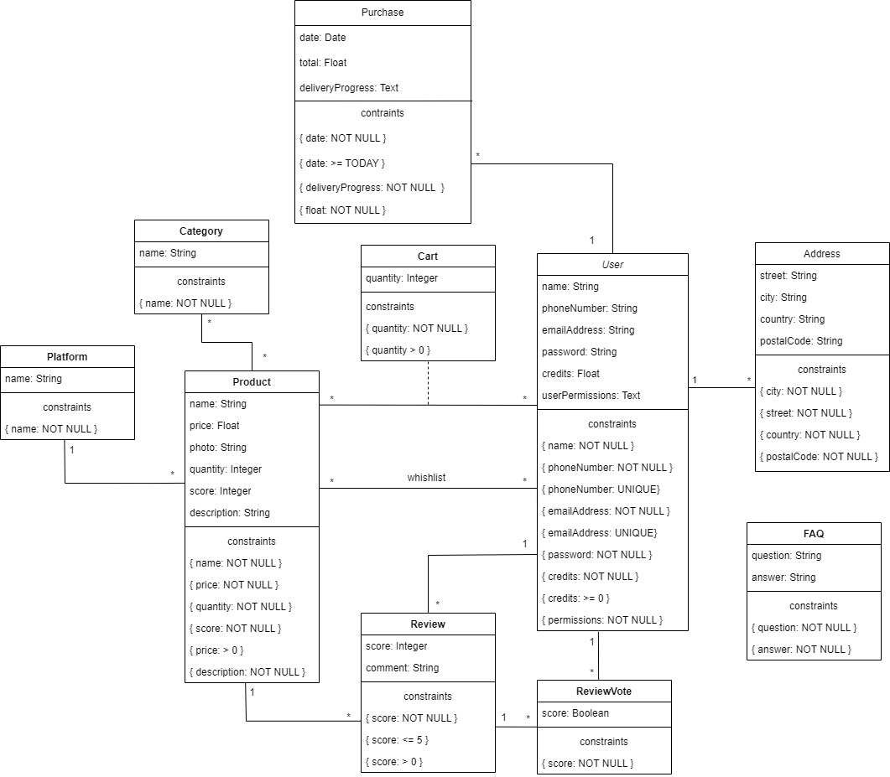

# EDB: Database Specification Component

## A4: Conceptual Data Model

The Conceptual Data Model contains the identification and description of the entities and relationships that are relevant to the database specification. Therefore, a UML class diagram is used to represent the information.

### 1. Class diagram

The UML diagram in Figure 1 shows the main entities, their relationships, attributes and domains. The multiplicity of relationships are present too.



<figcaption align= "center">Figure 1: UML Class Diagram</figcaption></p>

### 2. Additional Business Rules

Additional business rules or restrictions are described in text as UML notes in the diagram or as independent notes in this section.

| Identifier | Description |
|-----------------|--------------------------|
| BR01 | The total value of a purchase must be the sum of price of the purchased products. |
| BR02 | Update products' score according to all existing reviews. |
| BR03 | A user can only review a product that he has purchased. |
| BR05 | A product must have its category's required properties filled in. |
| BR06 | If the administrator removes a product, it will be removed from every cart and wishlist. |
| BR07 | A purchase's address must have to be in the user's addresses book. |


---


## A5: Relational Schema, validation and schema refinement

This artifact contains the Relational Schema obtained from the Conceptual Data Model.

### 1. Relational Schema

The Relational Schema includes the relation schemas, attributes, domains, primary keys, foreign keys and other integrity rules: UNIQUE, DEFAULT, NOT NULL, CHECK.  
Relation schemas are specified using a textual compact notation. 


| Relation reference | Relation Compact Notation                        |
| ------------------ | ------------------------------------------------ |
| R01                | users (<u>id</u>, name __NN__, phone_number __UK__ __NN__, email __UK__ __NN__, password __NN__, credits __NN__, permissions __NN__)                    |
| R02                | addresses (<u>id</u>, street __NN__, city __NN__, country __NN__, postal_code __NN__, <u>id_user</u> -> users) |
| R03                | platform (<u>id</u>, name __NN__ __UK__) |
| R04                | category (<u>id</u>, name __NN__ __UK__) |
| R05                | product (<u>id</u>, name __NN__, price __NN__ __CK__ price > 0, photo, score __NN__ __CK__ score > 0 and score <= 5, description __NN__, hardware __NN__, publication_date __NN__ __CK__ publication_date <= Today __DF__ Today, id_platform -> platform) |
| R06                | category_product (<u>id_category</u> -> category, <u>id_product</u> -> product) |
| R07                | review (<u>id</u>, id_product -> product, id_user -> users, score __NN__ __CK__ score > 0 and score <= 5, date __DF__ Today, comment) |
| R08                | review_vote (<u>id</u>, id_review -> review, id_user -> users, vote __NN__) |
| R09                | cart (<u>id_product</u> -> product, <u>id_user</u> -> users, quantity __NN__ __CK__ quantity > 0) |
| R10                | wishlist (<u>id_product</u> -> product, <u>id_user</u> -> users) |
| R11                | purchase (<u>id</u>, id_user -> users, date __NN__ __DF__ Today, total __NN__ __CK__ total > 0, deliveryProgress, <id_address -> addresses) |
| R12                | purchase_product (<u>id_purchase</u> -> purchase, <u>id_product</u> -> product, quantity __NN__ __CK__ quantity > 0)
| R13                | faq (<u>id</u>, question __NN__, answer __NN__) |

Legend:

* UK = UNIQUE KEY
* NN = NOT NULL
* DF = DEFAULT
* CK = CHECK

### 2. Domains

Specification of additional domains:

| Domain Name | Domain Specification           |
| ----------- | ------------------------------ |
| deliveryProgress  | ENUM ('Processing', 'Shipped', 'Delivered') |
| userPermission    | ENUM ('User', 'Admin') |

### 3. Schema validation

To validate the Relational Schema obtained from the Conceptual Data Model, all functional dependencies are identified and the normalization of all relation schemas is accomplished. 

| **TABLE R01**   | User               |
| --------------  | ---                |
| **Keys**        | { id }, { email }, {phoneNumber}  |
| **Functional Dependencies:** |       |
| FD0101          | id → {name, phoneNumber, email, password, credits, permissions} |
| FD0102          | email → {id, name, phoneNumber, password, credits, permissions} |
| FD0103          | phoneNumber → {id, name, email, password, credits, permissions} |
| **NORMAL FORM** | BCNF               |

| **TABLE R02** | Address |
| ------------- | ------- |
| **Keys**      | {id}    |
| **Functional Dependencies:** |
| FD0201        | id -> {userId, street, city, country, postalCode} |
| **NORMAL FORM** | BCNF |


| **TABLE R03**   | Platform           |
| --------------  | ---                |
| **Keys**        | { id }, { name }   |
| **Functional Dependencies:** |       |
| FD0401          | id → { name } |
| FD0401          | name → { id } |
| **NORMAL FORM** | BCNF               |

| **TABLE R04**   | Category           |
| --------------  | ---                |
| **Keys**        | { id }, { name }   |
| **Functional Dependencies:** |       |
| FD0501          | id → { name } |
| FD0501          | name → { id } |
| **NORMAL FORM** | BCNF               |

| **TABLE R05**   | Product            |
| --------------  | ---                |
| **Keys**        | { id } |
| **Functional Dependencies:** |       |
| FD0301          | id → { name, price, photo, score, description, id_platform } |
| **NORMAL FORM** | BCNF               |

| **TABLE R06**   | CategoryProduct    |
| --------------  | ---                |
| **Keys**        | { id_category, id_product }   |
| **Functional Dependencies:** | none |
| **NORMAL FORM** | BCNF               |

| **TABLE R07**   | Review             |
| --------------  | ---                |
| **Keys**        | { id }   |
| **Functional Dependencies:** |       |
| FD0701          | id → { id_product, id_user, score, comment } |
| **NORMAL FORM** | BCNF               |

| **TABLE R08**   | ReviewVote         |
| --------------  | ---                |
| **Keys**        | { id }   |
| **Functional Dependencies:** |       |
| FD0801          | id → { id_review, id_user, score } |
| **NORMAL FORM** | BCNF               |

| **TABLE R09**   | Cart               |
| --------------  | ---                |
| **Keys**        | { id_product, id_user }   |
| **Functional Dependencies:** |       |
| FD0901          | id_product, id_user → { quantity } |
| **NORMAL FORM** | BCNF               |

| **TABLE 10** | Wishlist |
| ------------- | ------- |
| **Keys**      | {id_product, id_user} |
| **Functional Dependencies:** | none |
| **NORMAL FORM** | BCNF |

| **TABLE R11** | Purchase |
| ------------- | ------- |
| **Keys**      | {id}    |
| **Functional Dependencies:** |
| FD1101        | id -> {id_user, date, total, deliveryProgress} |
| **NORMAL FORM** | BCNF |

| **TABLE R12** | Faq |
| ------------- | ------- |
| **Keys**      | {id}    |
| **Functional Dependencies:** |
| FD1201        | id -> {question, answer} |
| **NORMAL FORM** | BCNF |

Given that all the relations are in the Boyce-Codd Normal Form (BCNF), the relational schema is also in the BCNF. Therefore, the schema does not need to be further normalised.  

---


## A6: Indexes, triggers, transactions and database population

This artefact contains the physical schema of the database, the identification and characterisation of the indexes, the support of data integrity rules with triggers and the definition of the database user-defined functions. This artefact also contains the database's workload as well as the complete database creation script, including all SQL necessary to define all integrity constraints, indexes and triggers.

### 1. Database Workload

> A study of the predicted system load (database load).
> Estimate of tuples at each relation.

| **Relation reference** | **Relation Name** | **Order of magnitude** | **Estimated growth** |
| ------------------ | ------------- | ------------------------- | -------- |
| RS01                | Platform        | tens | units per year |
| RS02                | Category        | dozens | units per year |
| RS03                | Cart        | thousands | hundreds per day |
| RS04                | Product        | thousands | tens per day |
| RS05                | Review        | thousands | tens per day |
| RS06                | ReviewVote        | thousands | tens per day |
| RS07                | User        | thousands | dozens per day |
| RS08                | Address        | thounds | units per day |
| RS09                | FAQ        | tens | units per year |
| RS10                | Wishlist        | thousands | hundreds per day |
| RS11                | Purchase        | thousands | dozens per day |


### 2. Proposed Indices

#### 2.1. Performance Indices
 
> Indices proposed to improve performance of the identified queries.

| **Index**           | IDX01                                  |
| ---                 | ---                                    |
| **Relation**        | Relation where the index is applied    |
| **Attribute**       | Attribute where the index is applied   |
| **Type**            | B-tree, Hash, GiST or GIN              |
| **Cardinality**     | Attribute cardinality: low/medium/high |
| **Clustering**      | Clustering of the index                |
| **Justification**   | Justification for the proposed index   |
| `SQL code`                                                  ||

``` 
CREATE INDEX categoryid_products ON products USING hash (category_id);
```


| **Index**           | IDX02                                  |
| ---                 | ---                                    |
| **Relation**        | Relation where the index is applied    |
| **Attribute**       | Attribute where the index is applied   |
| **Type**            | B-tree, Hash, GiST or GIN              |
| **Cardinality**     | Attribute cardinality: low/medium/high |
| **Clustering**      | Clustering of the index                |
| **Justification**   | Justification for the proposed index   |
| `SQL code`                                                  ||


#### 2.2. Full-text Search Indices 

| **Index**           | IDX |
| ---                 | --- |
| **Relation**        | product |
| **Attribute**       | name, description, platform |
| **Type**            | GIN              |
| **Clustering**      | No                |
| **Justification**   | To look for products based on matching titles or words in the descritpion. The indexed types are not expected to change often so GIN type is used   |


```sql
-- Add column to product to store computed ts_vectors.
ALTER TABLE product
ADD COLUMN tsvectors TSVECTOR;

-- Create a function to automatically update ts_vectors.
CREATE FUNCTION product_search_update() RETURNS TRIGGER AS $$
BEGIN
 IF TG_OP = 'INSERT' THEN
        NEW.tsvectors = (
         setweight(to_tsvector('english', NEW.name), 'A') ||
         setweight(to_tsvector('english', NEW.description), 'B') ||
         setweight(to_tsvector('english', NEW.platform), 'C')
        );
 END IF;
 IF TG_OP = 'UPDATE' THEN
         IF (NEW.name <> OLD.name OR NEW.description <> OLD.description OR NEW.platform <> OLD.platform) THEN
           NEW.tsvectors = (
             setweight(to_tsvector('english', NEW.name), 'A') ||
             setweight(to_tsvector('english', NEW.description), 'B') ||
             setweight(to_tsvector('english', NEW.platform), 'C')
           );
         END IF;
 END IF;
 RETURN NEW;
END $$
LANGUAGE plpgsql;

-- Create a trigger before insert or update on product.
CREATE TRIGGER product_search_update
 BEFORE INSERT OR UPDATE ON product
 FOR EACH ROW
 EXECUTE PROCEDURE product_search_update();


-- Finally, create a GIN index for ts_vectors.
CREATE INDEX search_idx ON product USING GIN (tsvectors);
```

### 3. Triggers

| **Trigger**     | TRIGGER01                                                     |
| ---             | ---                                                           |
| **Description** | A product's score is updated everytime a review is submitted. |
| **SQL code**                                                                    |
```sql
CREATE FUNCTION update_product_score() RETURNS TRIGGER AS
$BODY$
BEGIN
    UPDATE product 
    SET score = (AVG(score) FROM review WHERE id_product = New.id_product) WHERE id = New.id_product 
END
$BODY$
LANGUAGE plpgsql;

CREATE TRIGGER update_score AFTER INSERT OR UPDATE OR DELETE ON review
FOR EACH ROW
EXECUTE PROCEDURE update_product_score();
```

| **Trigger**     | TRIGGER02                                                            |
| ---             | ---                                                                  |
| **Description** | After a purchase is made, decrease the stock of all bought products. |
| **SQL code**                                                                           |
```sql
CREATE FUNCTION update_stock() RETURNS TRIGGER AS
$BODY$
BEGIN
    UPDATE product
    SET quantity = quantity - New.quantity WHERE id = New.id_product;
END
$BODY$
LANGUAGE plpgsql;

CREATE TRIGGER update_stock AFTER INSERT ON purchase_product
FOR EACH ROW
EXECUTE PROCEDURE update_stock();
```

| **Trigger**     | TRIGGER03                                                                         |
| ---             | ---                                                                               |
| **Description** | A product can't be added to the cart in a quantity higher than the current stock. |
| **SQL code**                                                                                        |
```sql
CREATE FUNCTION check_cart_quantity() RETURNS TRIGGER AS
$BODY$
BEGIN
    IF
        NOT EXISTS(SELECT quantity FROM product WHERE id = New.id_product AND quantity >= New.quantity)
    THEN
        RAISE EXCEPTION 'Not enough items of %', New.id_product
    END IF;
    RETURN NEW;
END
$BODY$
LANGUAGE plpgsql;

CREATE TRIGGER check_valid_cart BEFORE INSERT
ON cart
EXECUTE PROCEDURE check_cart_quantity();
```

| **Trigger**     | TRIGGER04                                     |
| ---             | ---                                           |
| **Description** | The cart is cleared after a purchase is made. |
| **SQL code**                                                    |
```sql
CREATE FUNCTION clear_cart() RETURNS TRIGGER AS
$BODY$
BEGIN
    DELETE FROM cart
    WHERE id_user = New.id_user
END
$BODY$
LANGUAGE plpgsql;

CREATE TRIGGER clear_cart AFTER INSERT
ON purchase
EXECUTE PROCEDURE clear_cart();
```

| **Trigger**     | TRIGGER04                                                                   |
| ---             | ---                                                                         |
| **Description** | After a purchase, all bought products are removed from the user's wishlist. |
| **SQL code**                                                                                  |
```sql
CREATE FUNCTION clear_wishlist() RETURNS TRIGGER AS
$BODY$
BEGIN
    DELETE FROM wishlist
    WHERE id_user = (SELECT id_user FROM purchase WHERE id = New.id_purchase) AND id_product = NEW.id_product
END
$BODY$
LANGUAGE plpgsql;

CREATE TRIGGER clear_wishlist AFTER INSERT
ON purchase_product
FOR EACH ROW
EXECUTE PROCEDURE clear_wishlist();
```